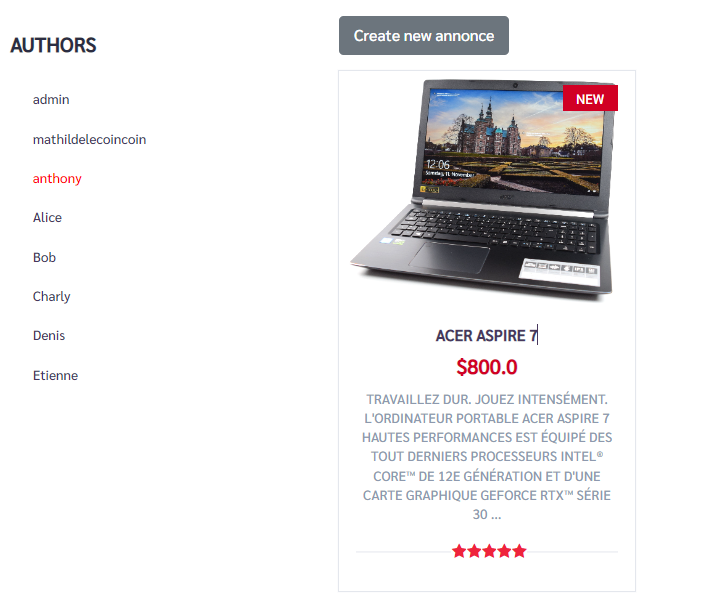

# Présentation du projet

Ce projet consiste à creer et mettre en place une application e-commerce
simplifiée à l'aide du framework
Grails.
<br><br>
L'objectif est la prise en charge de rôle utilisateur, de gestion d'acces
et une utilisation optimale des
ressources, controleur et services Grails.
<br><br>
Une segmentation d'interfaces utilisateurs permet d'utiliser une version cliente comme LeBonCoin
et un Dashboard d'administration.

Projet réalisé en groupe de 2 par:
- Yessine Ben el bey
- Anthony Malvesin

# Installation

```bash
  git clone https://github.com/Master-2-MIAGE-MBDS/grails-lecoincoin-gograils.git
  cd grails-lecoincoin-gograils
  grails run-app
```

# Versions
Version de Grails : 3.3.8

Java : OpenJDK 1.8

Git : version non pertinente

# How it works ?

## Backend

### Fonctionnalités présentes

- Utilisation de SpringSecurity pour la gestion des rôles et des accés
  - Un administrateur peut tout faire
  - Les modérateurs ne peuvent pas créer d'User et d'Annonces mais peuvent les modifier
- Gérer le rôle client
  - Récupération du rôle de la personne connecté pour savoir si c'est un client, si c'est un client, vérifier si elle édite bien son annonce et qu'elle créee une annonce à       lui même
- Gérer une ou plusieurs illustrations via les interfaces annonces
   - Création d'un fichier ayant pour extension .png dans les ressources
   - Création de l'illustration ayant pour image le fichier qui a été crée
### API REST
- Gérer les requêtes GET / PUT / PATCH / POST / DELETE
  - Gérer avec un body JSON
  - Gérer avec un body XML
  - Gérer les illustrations avec un envoie base64 de l'image dans le body
  - Envoie d'un code erreur et d'un message d'erreur quand une requête ne s'est pas bien passée
### Ce qui n'a pas été fait
- Code métier dans les services, mais cela n'a pas été fait pour faciliter la correction du professeur
## Frontends

Utilisation de 2 layouts differents:
<br><br>

### Dashboard Admin
client.gsp -> Interface client au path /client/... <br>
main.gsp -> Dashboard au path /... <br>

- Seul les moderateurs et admin ont acces aux pages
- Toutes les opérations du CRUD sont disponibles sur
  - User
  - Annonces
- Un acces a l'interface client est disponible
- Redirection dynamique à la connexion (User client -> frontend client)
- S'identifier / Se deconnecter


<br><br>


### Lecoincoin Client

- Les utilisateurs peuvent filtrer la liste des annonces par auteurs
- La gestion des droits étant effectuée dans les controllers, un client ne peut pas modifier une annonce qui ne lui appartient pas
- Les utilisateurs peuvent lister leurs propres annonces
- Un admin peut acceder au Dashboard depuis l'interface client
- Interface responsive
- S'identifier / Se deconnecter

Pages/Chemins:
<br><br>
/client/newAnnonce

<br><br>
/client/editAnnonce/1

<br><br>
/client/annoncesList?author=1

<br><br>
/client/product/28


# Postman
 - Deux collections par type de requêtes
   - Collection permettant de tester avec l'envoie d'un body en JSON
   - Collection permettant de tester avec l'envoie d'un body en XML
# Heroku
  - Lien du déploiement: http://coincoinmbdsm2.herokuapp.com/
  - Création et modification d'annonces ne fonctionnent pas sur Heroku à cause des images qui ne peuvent pas être stockées

